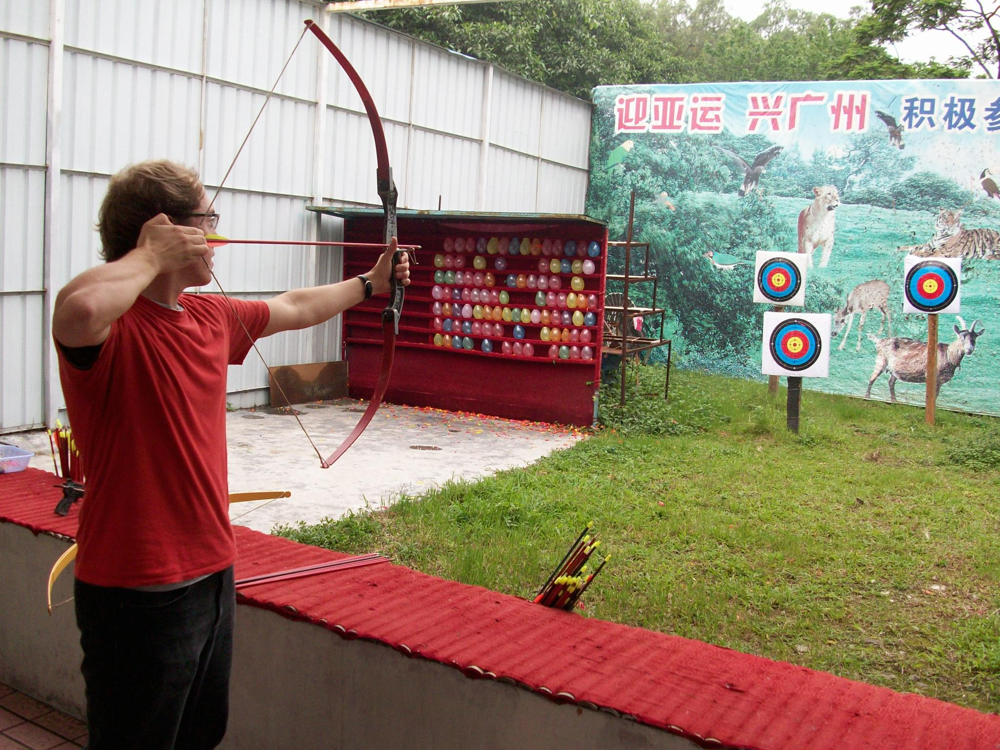
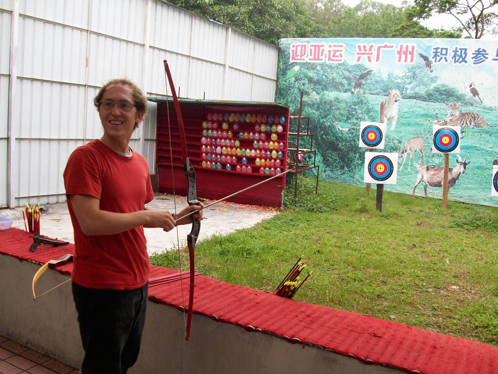
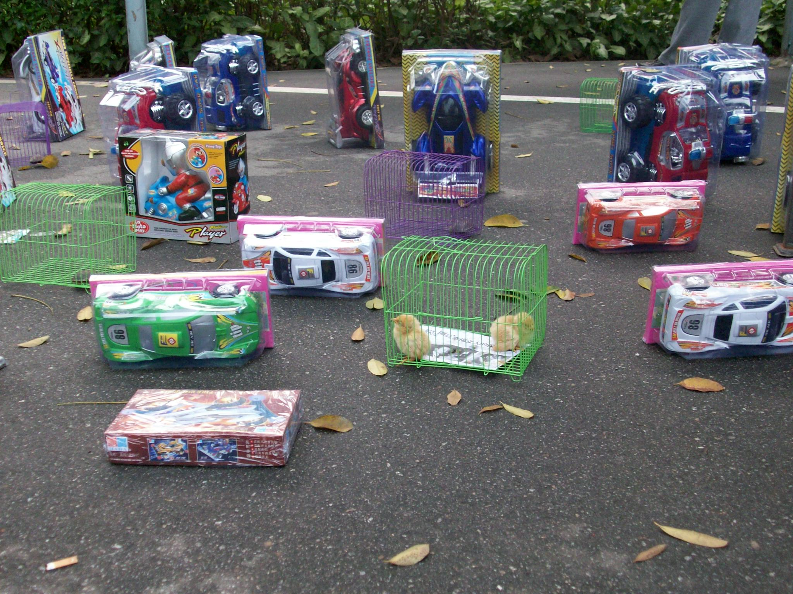
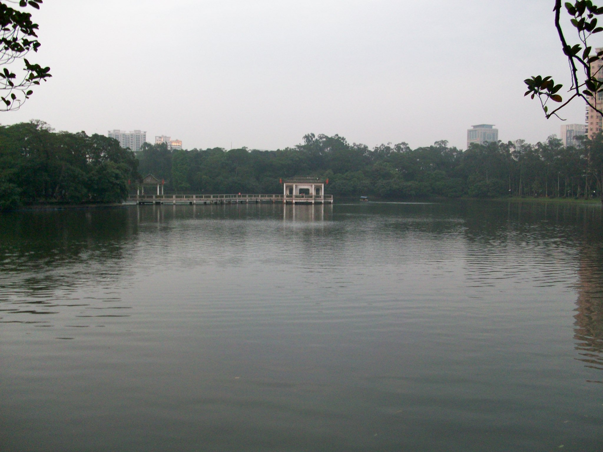
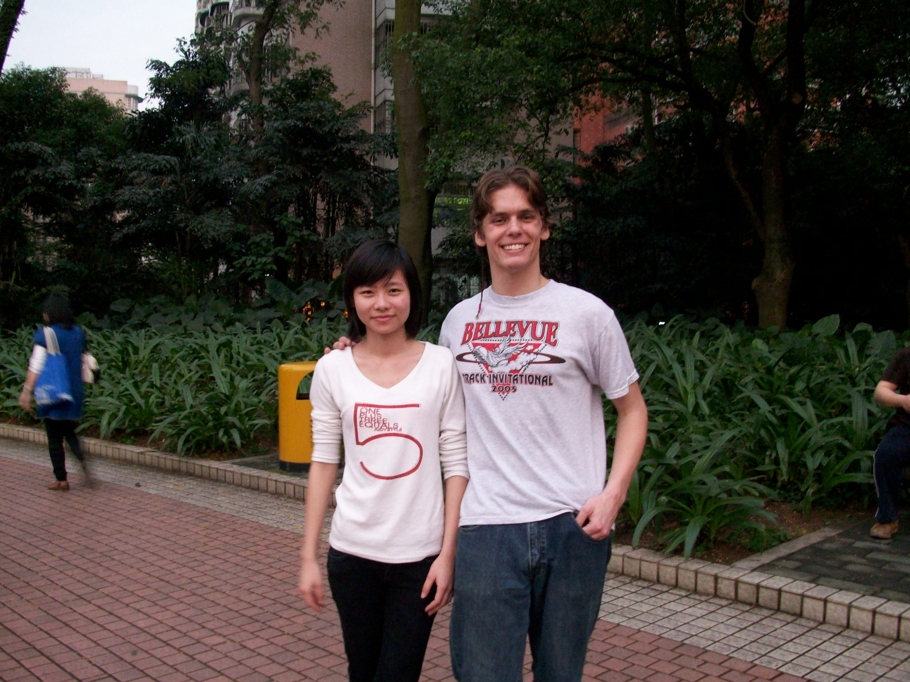

+++
title = "Tianhe Park (天河 公园) and Brian"
date = "2010-04-22T11:58:30+00:00"
tags = ["China"]
categories = []
image = "100_0199.JPG"
+++

A few weeks ago a new foreign teacher came.  I met him at Tianhe park and we looked around and explored a little bit.

Photos:

