+++
title = "Tough Mudder"
date = "2013-05-04T00:19:49+00:00"
tags = ["Running"]
categories = []
image = "KypJfL5na4JHBO13G3atqzhKVa8Cibb-HtSkZmJXekA.jpeg"
+++

Alex 'Criminoli' Cimaroli and I ran the tough mudder in Mansfield Ohio. It was tough and muddy for sure, but more muddy than tough. There were a ton of sections where I couldn't even consider what I was doing running because the mud was so thick. Criminoli was losing his shoes throughout the race. My parents and Maggie came to watch.

Photos:

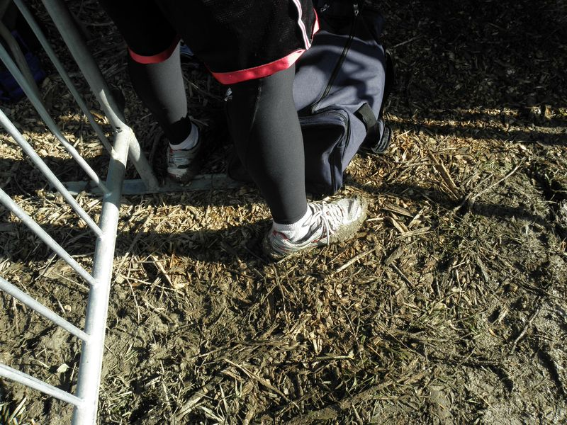
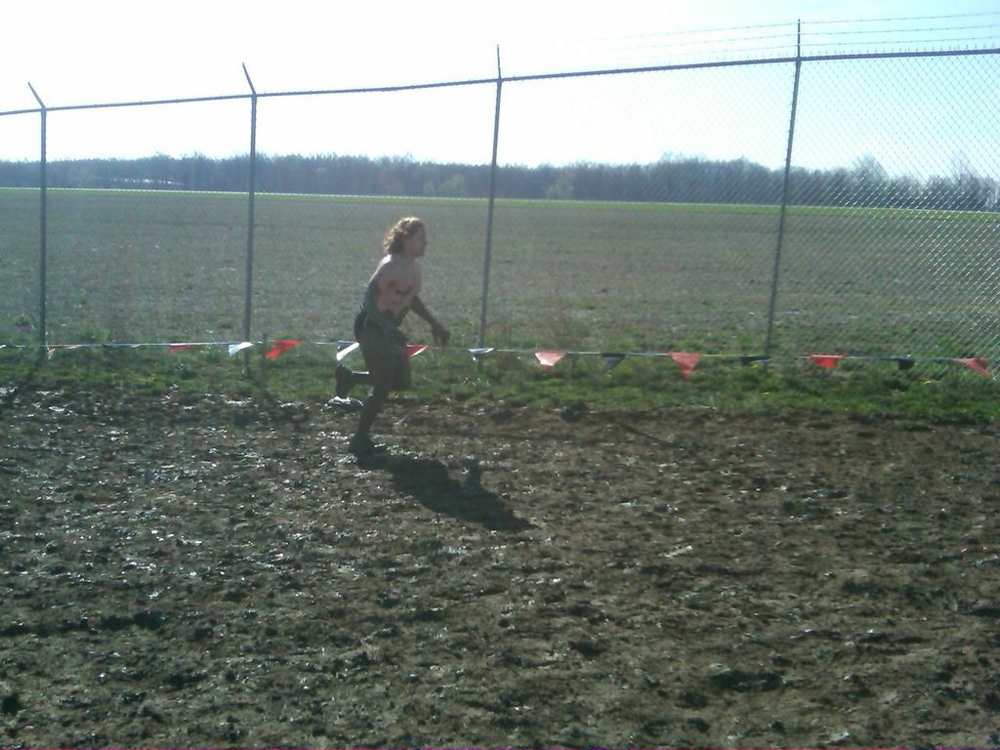
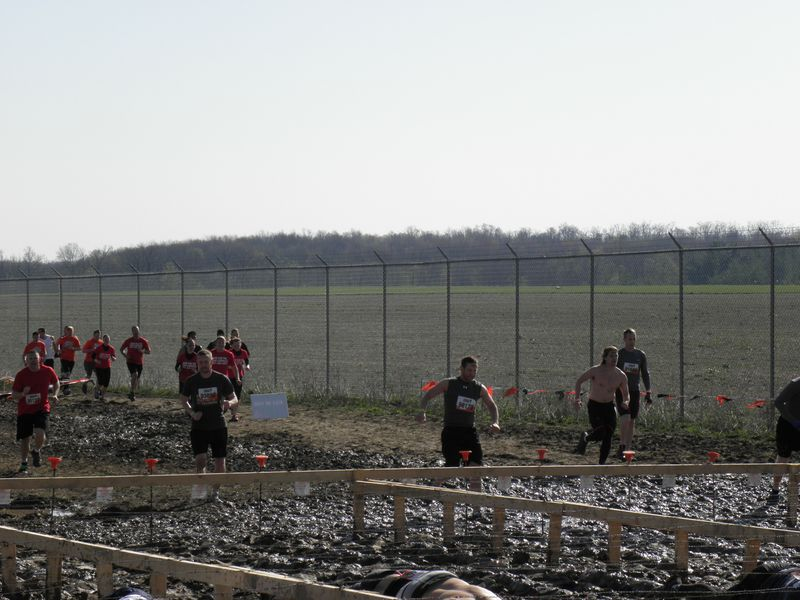
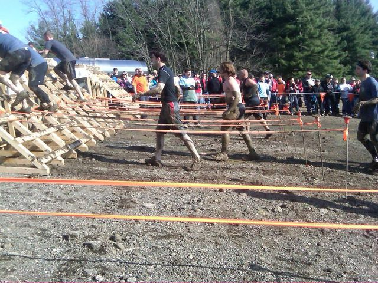
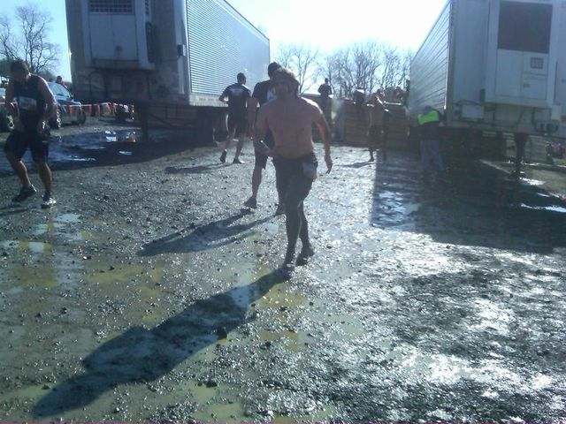

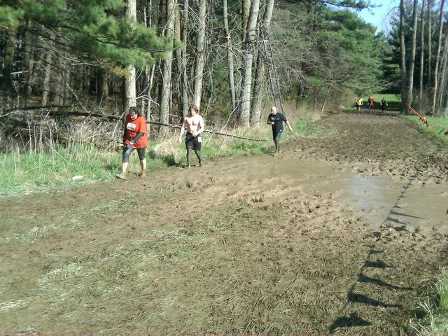
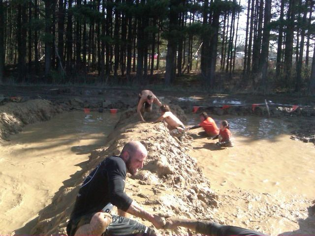
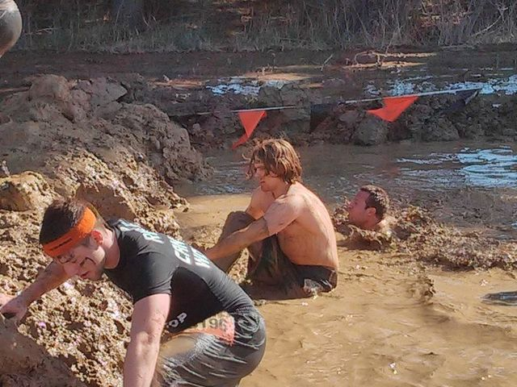
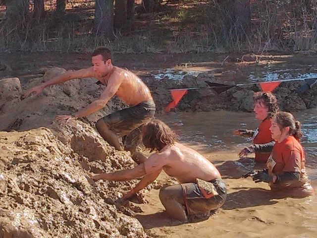
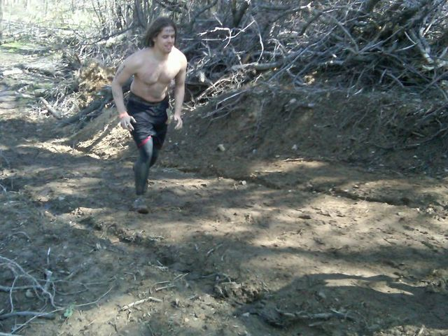

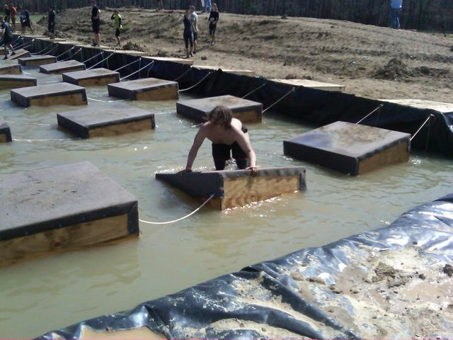
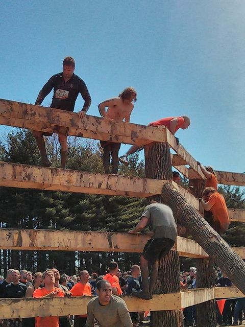
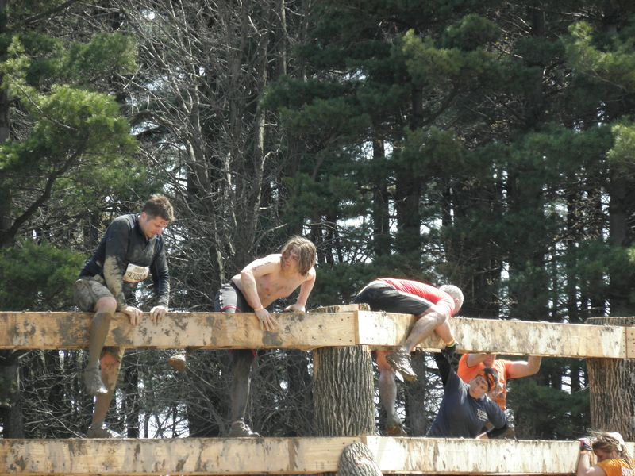
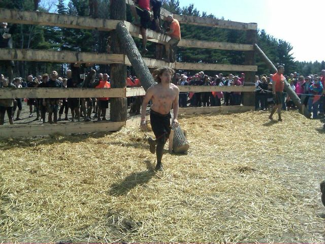
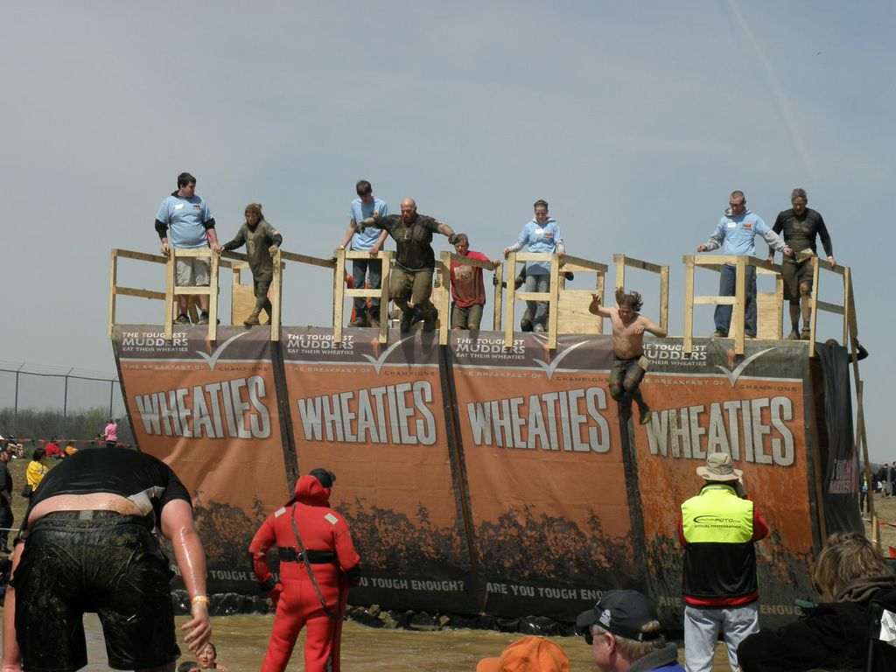

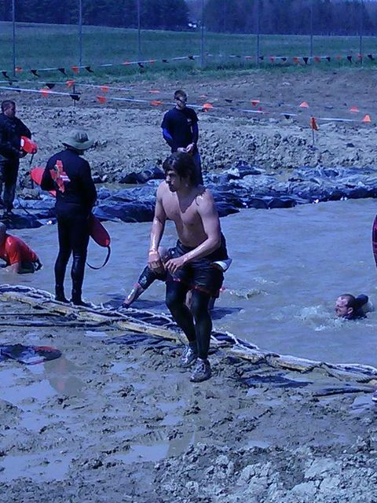
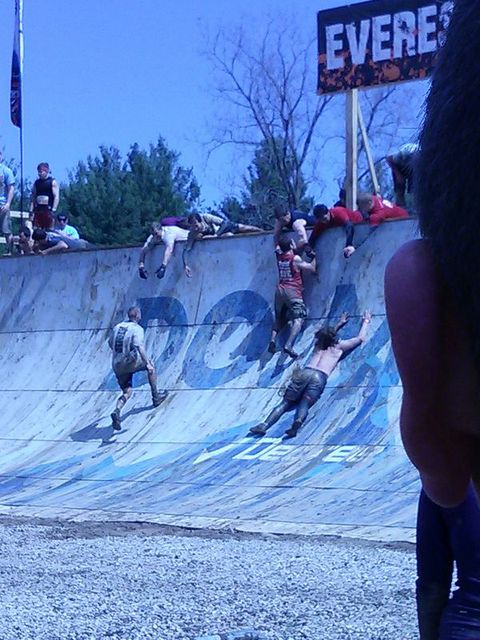
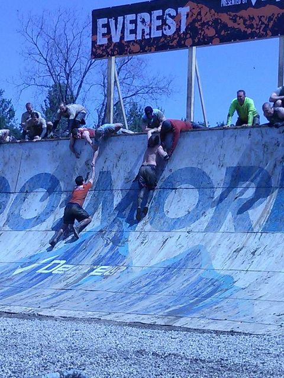
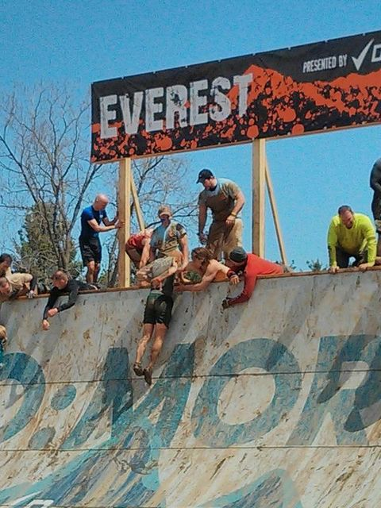
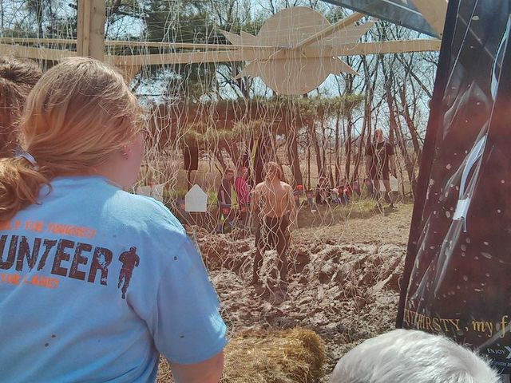

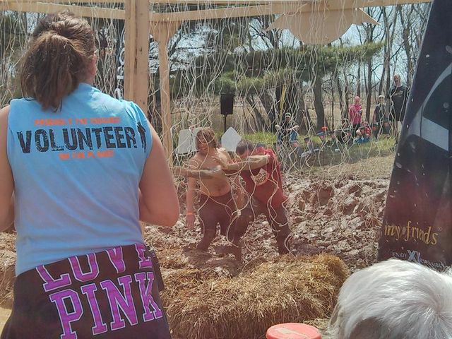
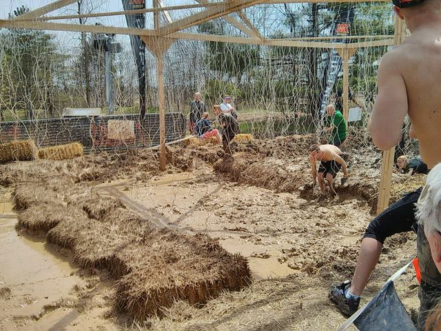
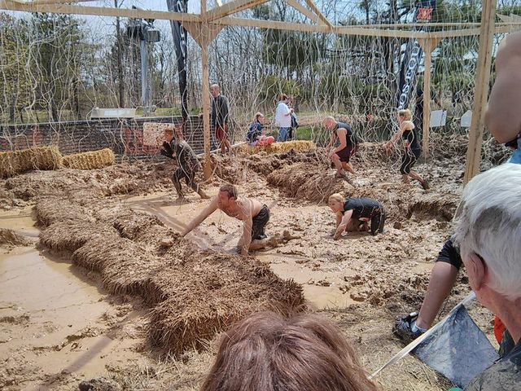
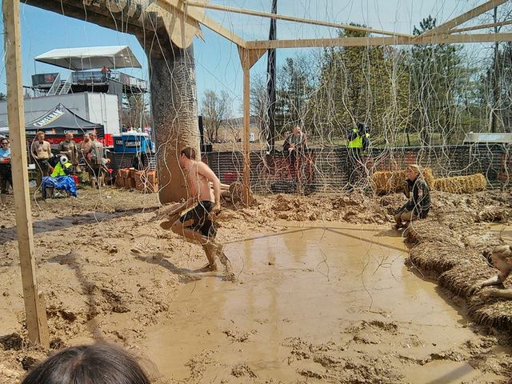
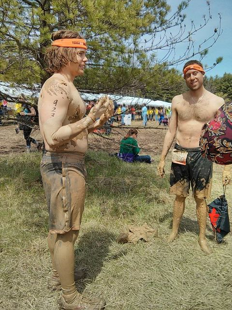
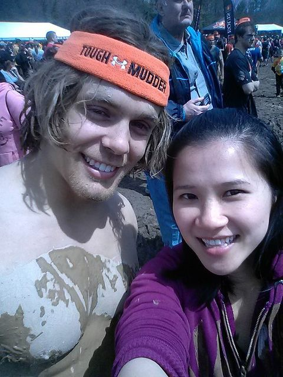
