+++
title = "Touring Mumbai"
date = "2013-08-27T21:07:32+00:00"
tags = ["Travel", "India"]
categories = []
image = "IMG_20130807_111355.jpg"
+++

I had the opportunity to see India with my friend Aditya, a former classmate from the University of Toledo. His family lives in Mumbai, so I flew in there, and we spent a few days seeing the city. At first I saw the area near where he grew up. Another day we took a bus tour of the city, the next he showed me around his former University and some areas that the tour didn't cover. There was lot to see in do in the city itself.

Photos:

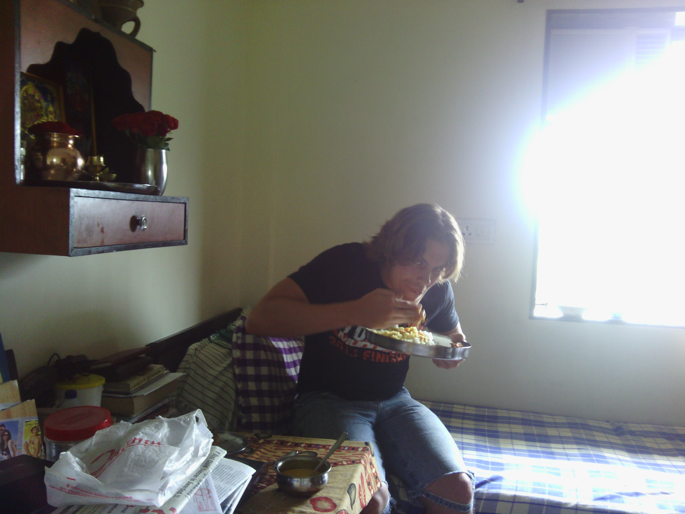
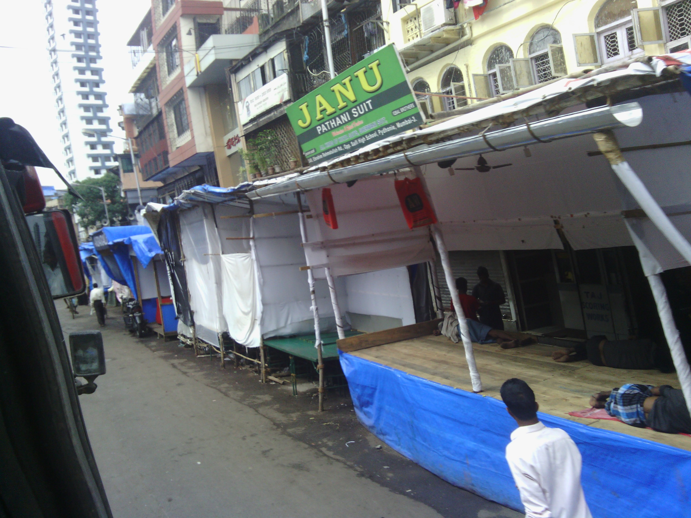
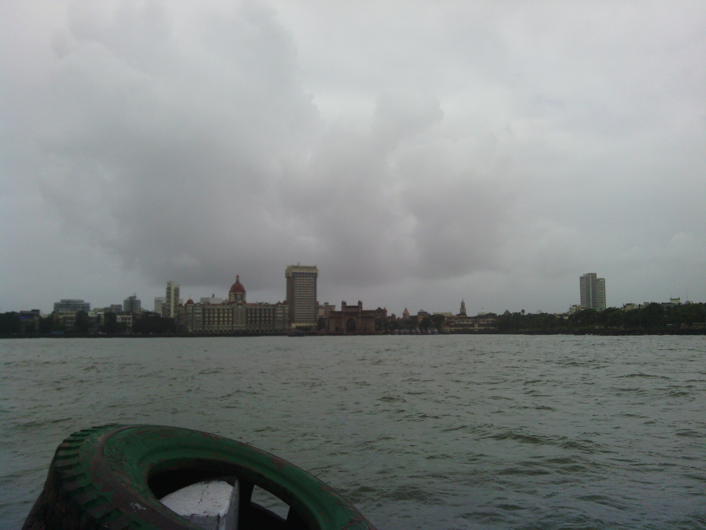
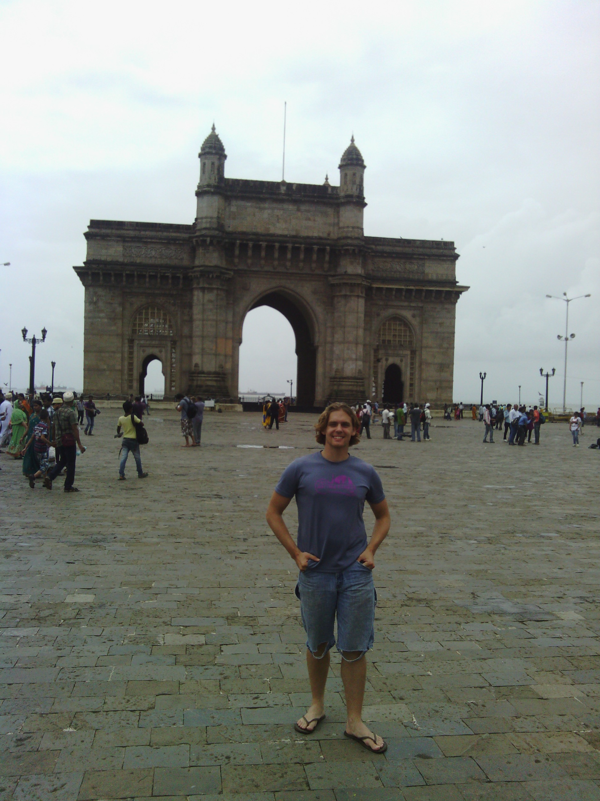
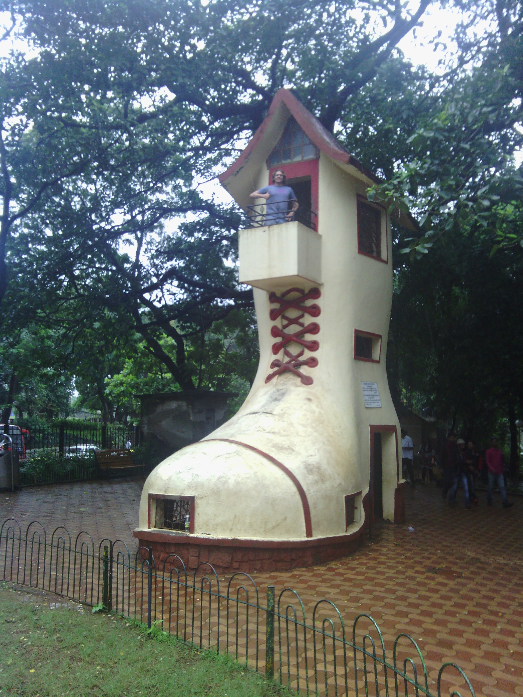

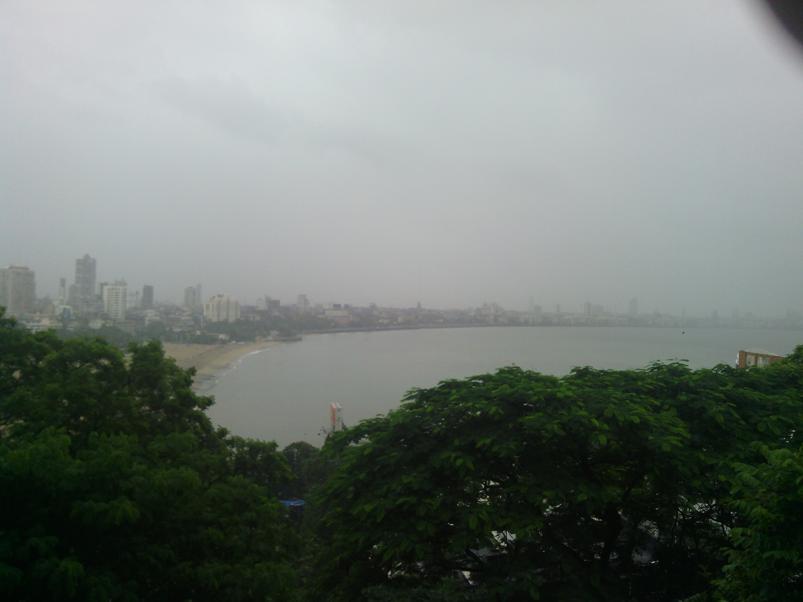
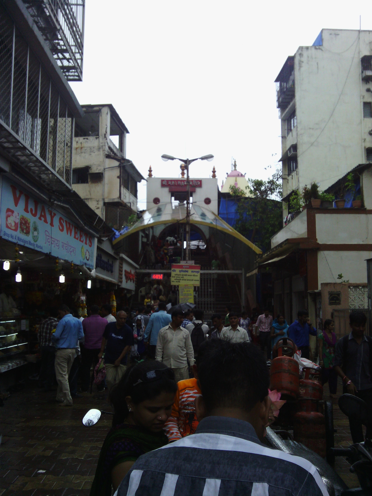
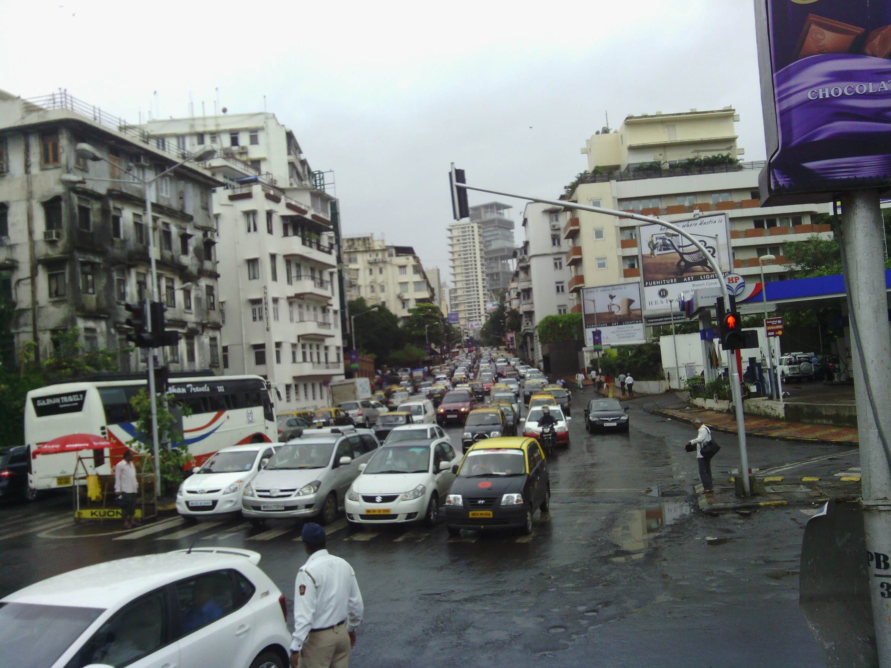
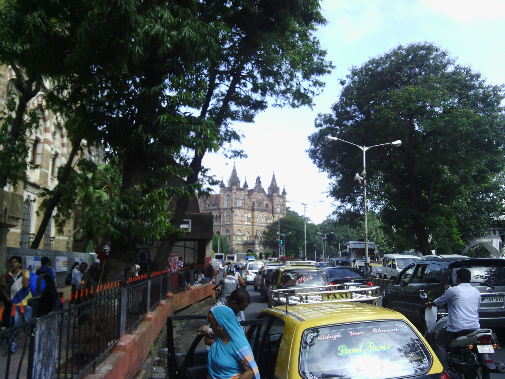

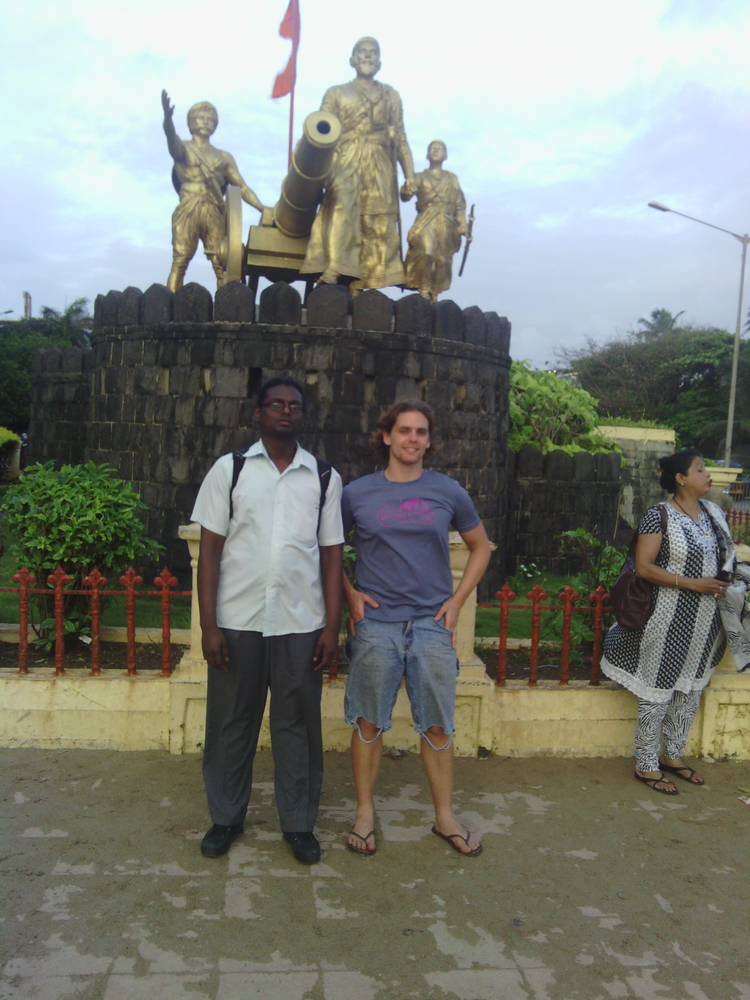
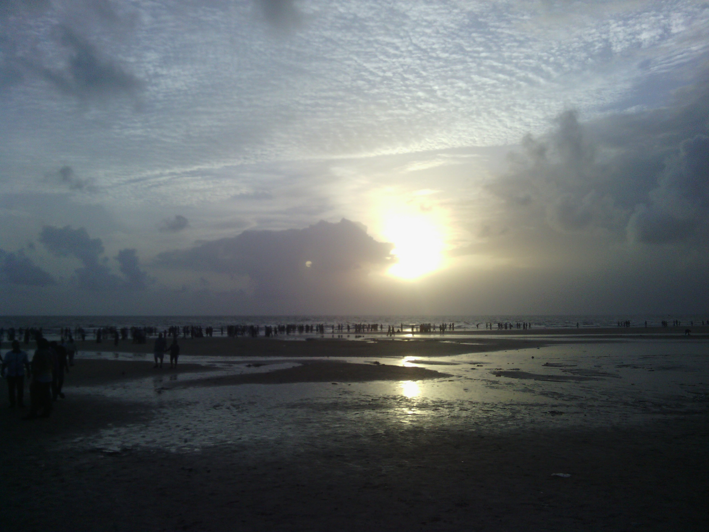
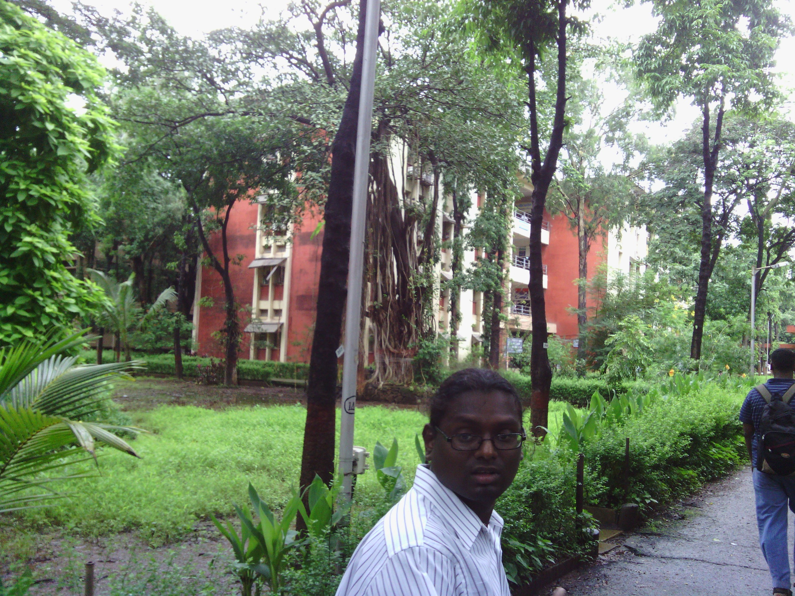
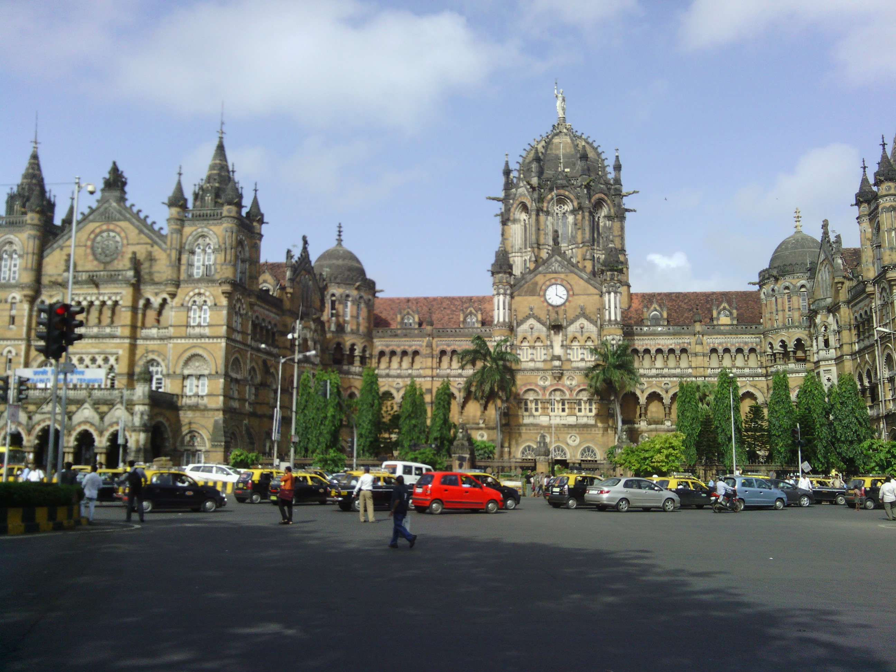
