+++
title = "Warrior Dash 2011"
date = "2011-04-11T04:54:19+00:00"
tags = ["running"]
categories = []
image = "WholeCrew.jpg"
+++

The Warrior Dash was one of the crazier races I've run.  It was in Lake Elsinore, CA, and was just shy of 5k.  A few of us went down to give it a go, and see if we could conquer the many obstacles that were throughout the course.  I was hoping in the back of my mind to win this race, but I ended up taking 11th place overall.  I could have potentially done a little better if I hadn't made a <a href="/node/364">wrong turn</a>, but I'm pretty happy with 11th.

Some of these photos were taken professionally and still have watermarks... I don't feel bad about that.

Photos:

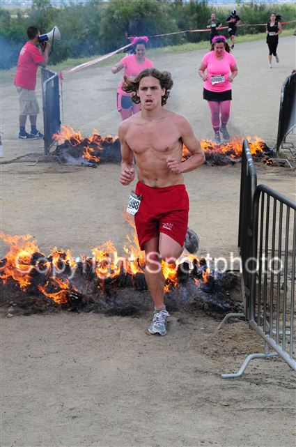
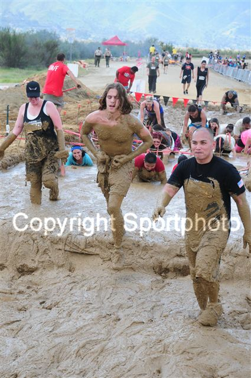
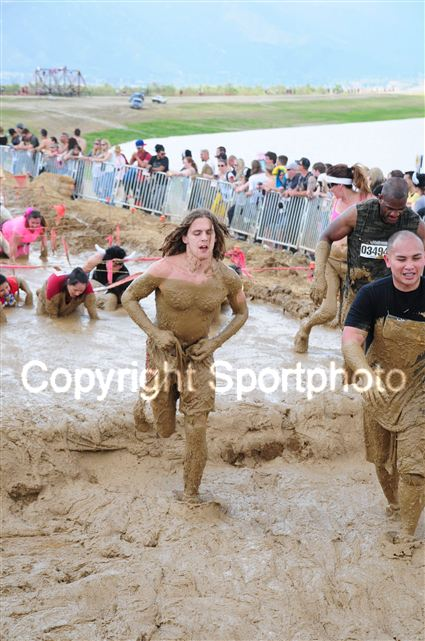
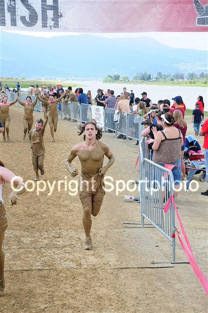
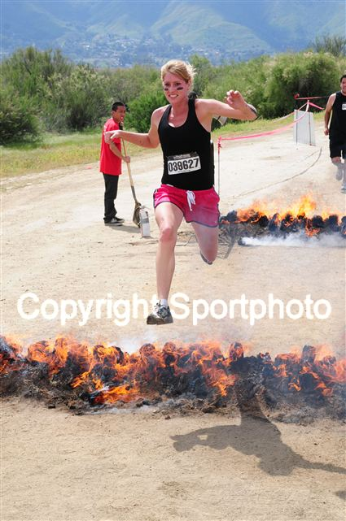

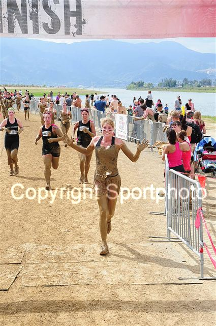
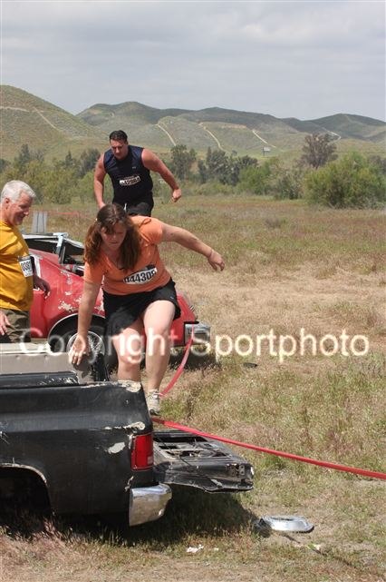
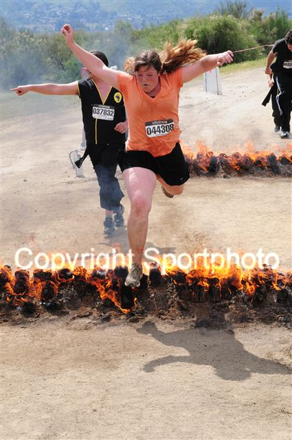
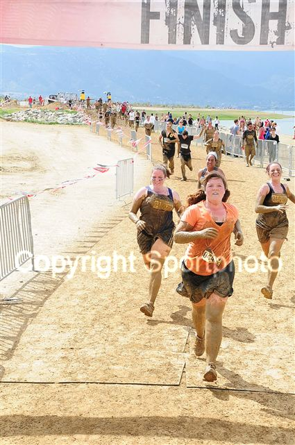
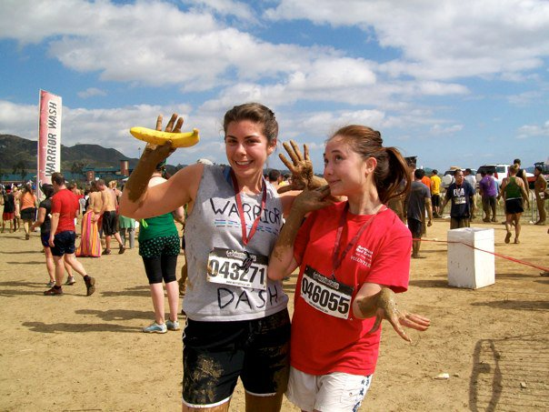

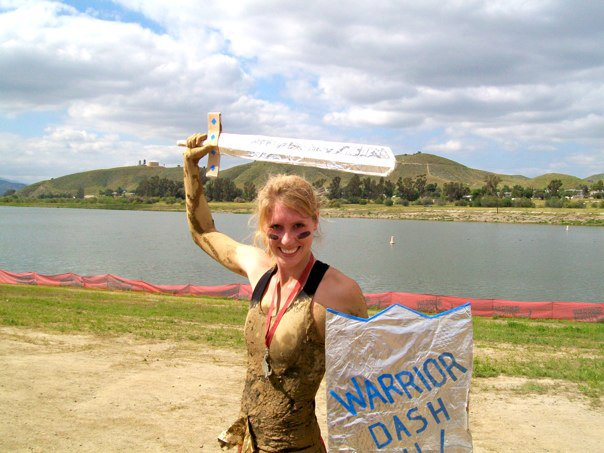
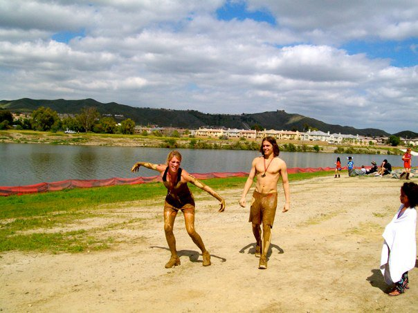
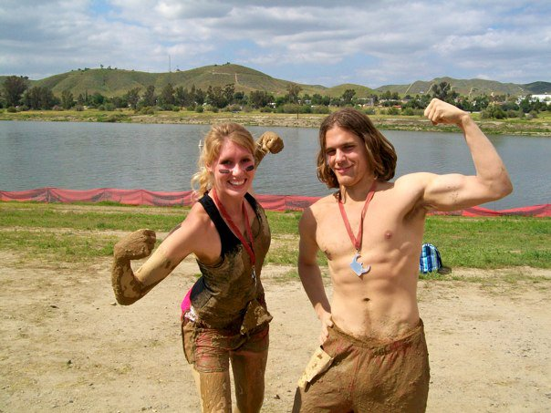
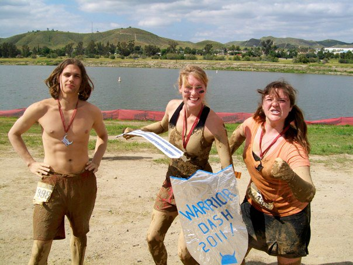
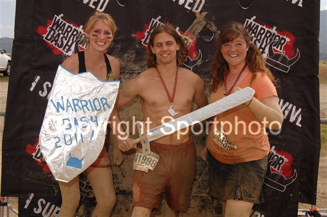
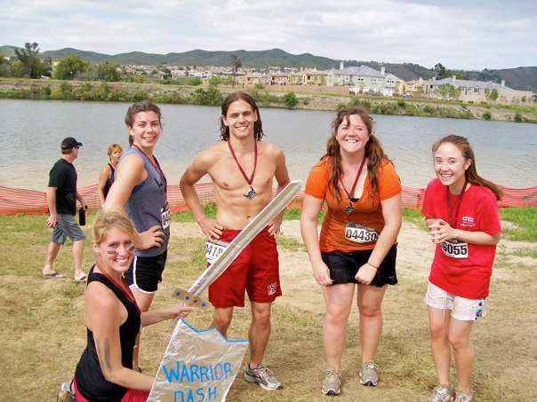
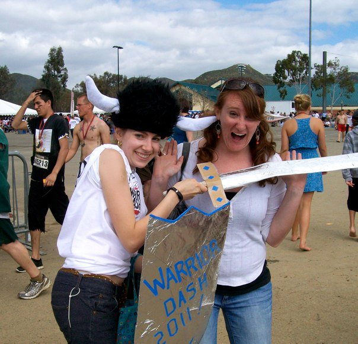
