+++
title = "Warrior Dash 2012"
date = "2012-08-12T05:30:51+00:00"
tags = ["running"]
categories = []
image = "DSCN3282.JPG"
+++

After <a href="/warrior-dash-2011">last year's wrong turn</a> at the SoCal warrior dash, I figured I'd have another go at it. So several of my classmates and I went down to Logan, Ohio to compete. I wasn't in as good of shape as last year, so I didn't really have much of a shot of winning it this time. Everyone had a good time despite getting caught in traffic on the course. The best part was probably barreling down a mudslide hill falling all over the place and taking out the slower crew from the previous heat.

Photos:

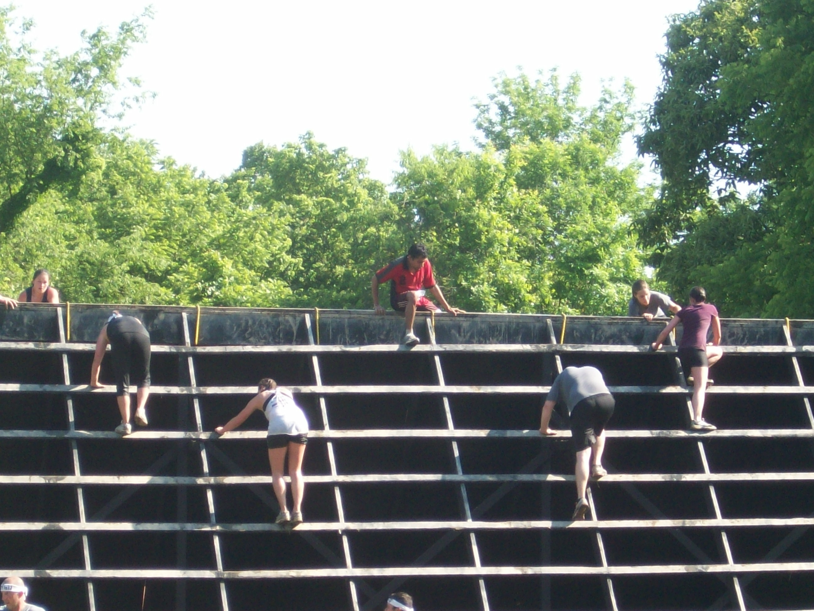
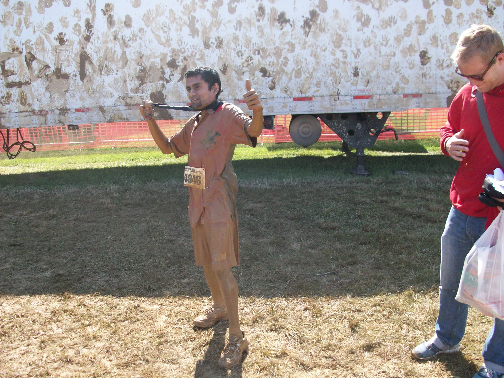
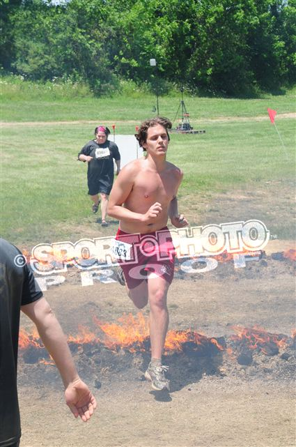
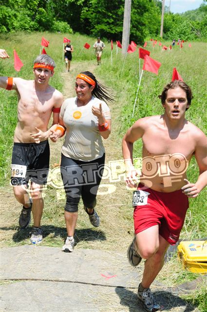
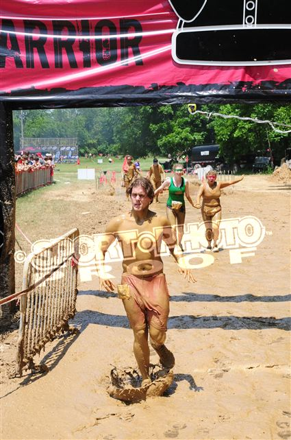

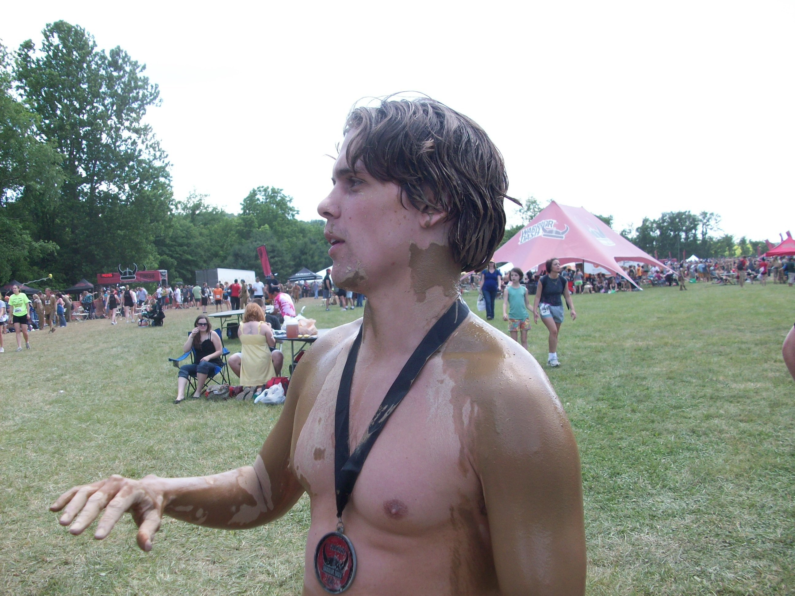
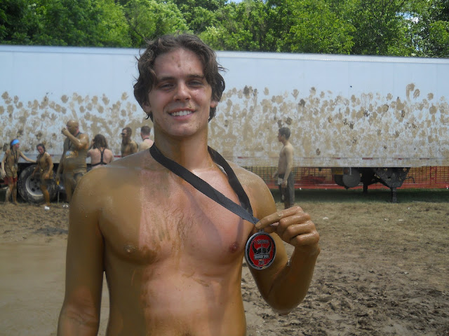
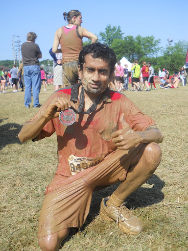
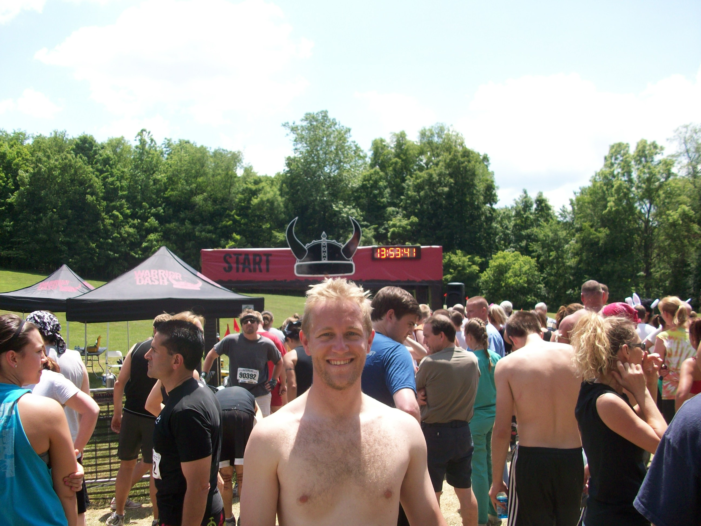

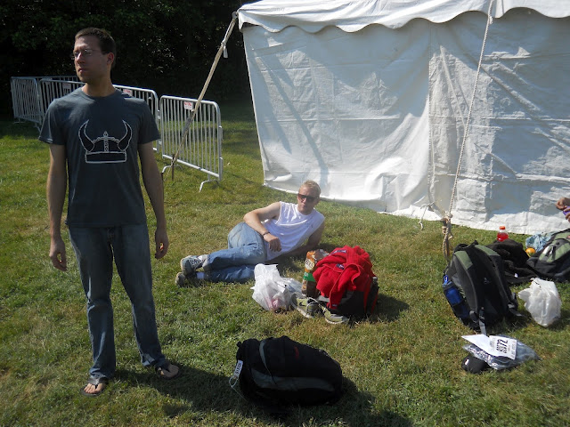
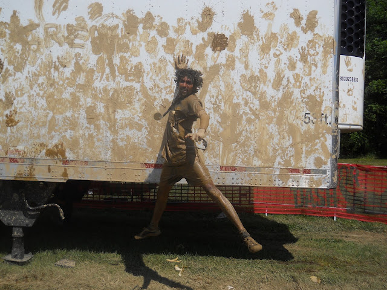
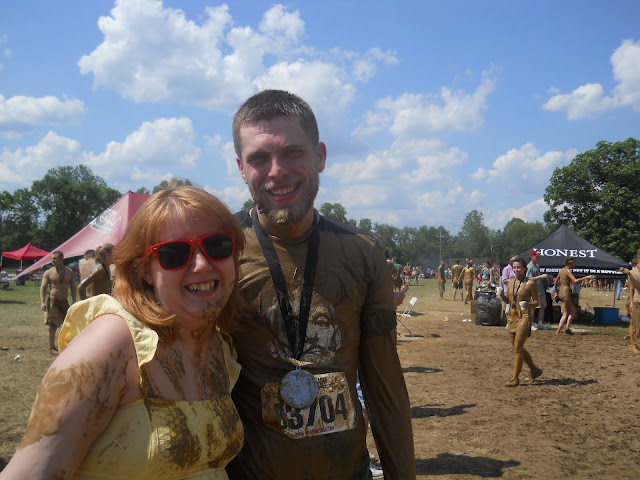
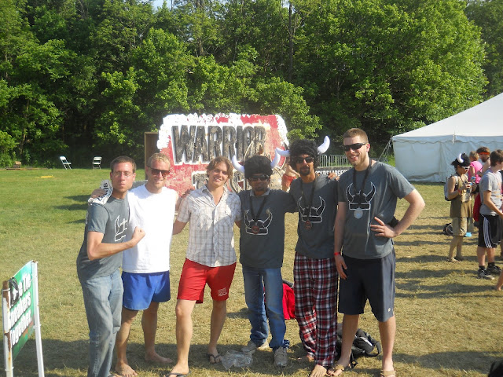
