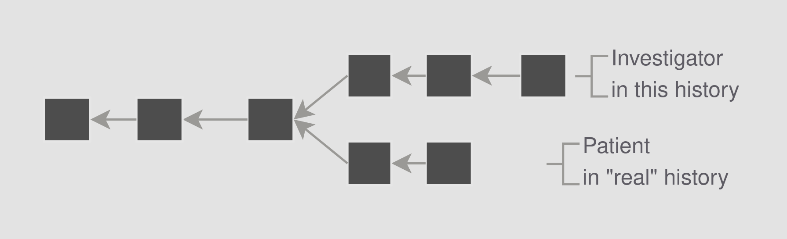
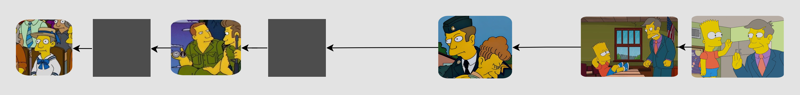
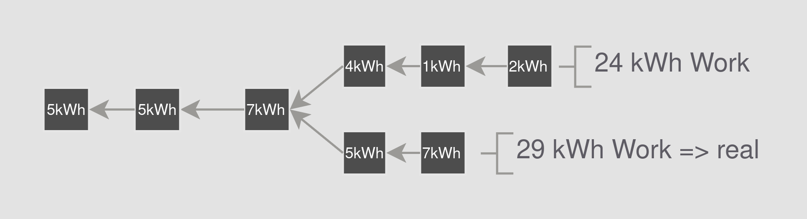

+++
title = "Everything is Weakly Subjective, Even Bitcoin"
date = "2025-03-25"

tags = [
    "blockchain",
    "consensus",
    "subjectivity",
    "simpsons",
    "plot twist",
    "reorg",
]
categories = []
image = "simpsons-full.png"
+++

There is a particular kind of plot twist that I really enjoy in fiction. It is when you realize very late in the story that the protagonist (or narrator) has been confused from the beginning about the very nature of the setting in which the story has taken place.

One of my favorite examples is the [movie Shutter Island](https://en.wikipedia.org/wiki/Shutter_Island_(film)) in which the protagonist is an investigator investigating a creepy mental hospital suspecting the director of inhumane experiments on patients. Near the end you learn that the protagonist is actually a patient in the hospital and the story you had believed to be true is a combination of hallucinations and a carefully designed psychiatric intervention. The audience is left to feel the same confusion and struggle for acceptance as the Protagonist.

## Re-Organizing History

This is analogous to a technical situation that arises in blockchain called a chain reorganization, or "re-org". A re-org happens when a blockchain node realizes that the chain that it thought was real, actually isn't, and it needs to switch to a different chain that is better or more real.

The goal of blockchain is to _eventually_ reach consensus on the history of that chain and decide which of the branches is "real". But of course more stuff is happening all the time, and the chain is constantly growing. Thus the job of reaching consensus is never done but rather ongoing. This is similar to how populations of people come to an understanding of current events and transition them into the realm of history. In the 90s I experienced this process as gossip -> radio gossip -> newspaper news -> Chamber of Commerce publication -> library book. Of course some stuff turned out not to be true or fully true and didn't filter all the way down to library book level.

More on how blockchains work along with traditional social means to reach consensus shortly, but first let's understand re-orgs better with another example from fiction.

## Armen Tamzarian

In the Simpsons Episode, [The Principal and the Pauper](https://simpsons.fandom.com/wiki/The_Principal_and_the_Pauper), Principle Skinner reveals that he has long been a fraud filling the shoes of a person who had gone missing in Viet Nam. The other characters struggle to accept the truth, and in the end they agree to go on living with the fraud because nobody wanted to go back to the "real" truth.If you haven't seen the episode, I recommend torrenting it because it is awesome.

Before the episode, we know that Principle Skinner grew up in Springfield, served briefly in the army, returned home, became principle and nowadays has shenanigans with Bart and the kids. You can imaging his history looking something like the following in terms of a blockchain.

The plain blocks indicate that there are probably more details relevant to skinners past that we are not aware of and may eventually fill in as his character is developed more. During the episode we learn of another character, Armen Tamzarianm, who looks like Skinner and grew up as a bad boy in capital city. Tamzarien also joined the army around the same time as Skinner and indeed they met in Viet Nam. So far this is no problem, these details are all compatible with the Skinner we know and love. Indeed we love him more now for having learned more details of his past. We can now imagine Skinner's history like this.

But next we get the bombshell. The real Skinner never returned from Viet Nam. He has been held hostage ever since and only recently returned home. The man who we have known and loved for eight seasons is actually Tamzarien. 😱 He has been living a lie all this time. The shenanigans that were had with Bart and the kids were with Tamzarian. And now the real Skinner is finally home and the truth is out and we are supposed to try to reorg.

The characters in the Simpson's collectively choose to go on living as if the person they have known for decades is the real Skinner. This is despite real evidence (genetics, military records, Tamzarian's confession) of the fraud. Together they coordinate to all agree to continue living the previously understood reality thereby making it effectively real. It certainly wouldn't work out if only some people went on believing the old truth while some accepted the new. Consensus is critical.

Just as the Simpson's Characters struggled to accept the new truth, so also did the real life audience. Principal Skinner is third character to speak in the entire Simpsons series, and the first person outside the Simpson family. He is a well loved character and re-writing his history is unpalatable to both the characters in the show and the fans watching at home. The Simpsons wiki notes that the episode is considered "non-canon". The exact same term is used in blockchain to refer to blocks that are not part of the "real" chain or got "orphaned" off.

## Some Things Cannot be Re-Organized

Not all re-orgs are of the same seriousness. It's one thing when that news story you read this morning turns out to be false. It probably didn't affect you much and even if it did, it was only this morning. It's another thing to learn that your months-long romance turned out to be a pig butchering scam, and still another entirely to find out that your career as an investigator was a combination of hallucination and hoax.

In this post I will argue that **humans only have a finite willingness to reorganize their understanding of reality**. Much like Springfieldians who continue to treat Skinner as a Principal, humans will not be willing to re-organize their most cherished memories away, and this extends to bitcoin with its supposed "objective" consensus rule.

Consider some religious myths that many people deeply believe in. My favorite is the [account from the book of mormon](https://en.wikipedia.org/wiki/Archaeology_and_the_Book_of_Mormon) where some tribes of Israel crossed the ocean to become the ancestors of the Native Americans. But you need not look anywhere nearly as exotic as the Mormons to find examples. Consider [Noah's Ark](https://en.wikipedia.org/wiki/Noah%27s_Ark), a myth that most people throughout the world will have in their tradition in some form or another.

There are people who genuinely believe that Noah's Ark literally existed and saved all the animals despite overwhelming evidence and logical arguments to the contrary. It simply isn't open to being re-orged. I remember having this discussion with a guy, "Stinky", in my freshman dorm. Stinky believed in Noah's Ark and a literal 6 day creation. He knew the archeology, he understood why I didn't believe it, but he just knew it was true because, "honestly, that's just what I grew up with".

Other people will take a more moderate approach saying that the stories don't have to be literally true to impart valuable moral lessons. "Maybe Joseph Smith did make the whole thing up, but it still helps me have a loving family and be a good person today." I leave it as an exercise to the reader to decide to what extent this is analogous to a proper re-org.

## Objectivity vs Subjectivity

In blockchain, the entire goal is to **reach consensus on a shared history**. Don't be too distracted by the tokens and defi and daos; those are all applications enabled by the fundamental point which is reaching consensus on a shared history. Many consensus mechanisms and variations thereof have been proposed and implemented. For the sake of this post, I will classify them broadly into three categories. For more details and technicals on this, see Vitalik's blog post, [How I Learned to Love Weak Subjectivity](https://blog.ethereum.org/2014/11/25/proof-stake-learned-love-weak-subjectivity).

### Objective Consensus

In objective Consensus, anyone can tell which history is real just by looking at the history itself. No need to trust anyone or have any doubts. The most famous example of this is Bitcoin-style proof of work. It requires a lot of real-world energy to produce bitcoin blocks and when they are produced you can tell how much energy it took to create just by looking at it. So if there are two different histories, you just choose the one that took the most energy to create. You don't have to ask any questions to anyone or trust anyone in any way.

### Subjective Consensus

Subjective consensus is when you can tell nothing on your own and simply have to ask around and use old-school human social skills to discern what is true. For example if you see two different copies of an essay, you could ask the author which is real. If the author is dead you might have to ask their relatives and fans, or your trusted sources like newspapers or your parents, or read a lot of their other essays to learn their style and determine which copy of the essay you believe to be true for yourself.

This consensus is not used in any blockchain, but is the defacto standard for human communities prior to the turn of the millennium. And it is not to be underrated. The human social machinery has evolved over millions of years and is very good at figuring out what a community considers "real" or true.

### Weakly Subjective Consensus

Weakly subjective is the middle ground, and in practice, it is as close as possible to objective. As a concrete example, in Ethereum, the consensus is completely objective as long as you (your node that runs in the background on your device) come online every few hours. The only time there is subjectivity is when you first join the network or when you first re-join after some significant away time. In this case you just need to know a recent block hash that everyone agrees on.

## Bitcoin is Weakly Subjective

Bitcoin's rule about choosing the chain with the most accumulated work is certainly objective as I described above. But I argue that **the Social Layer is a more fundamental consensus layer** involved in Bitcoin even that the Objective PoW. In the same way that humans struggle to disavow religious myths, so they will struggle and perhaps refuse to re-org their bitcoin history.

### Consider a Deep Re-Org

Take a moment to consider your favorite story from the history of Bitcoin. Think way back if you can. Is it the silk road? Is it bitcoin pizza guy? Is it the Ethereum ICO? Is it the Mt Gox Hack? Was it that first bitcoin you mined back in 2015 that you then lost and forgot about?

Now imagine that one day, maybe tomorrow, or next year, a bitcoin block chain is discovered that has more total proof of work than the chain that most of the nodes and explorers had been tracking. No problem; this is PoW; re-orgs happen. But imagine this chain is a very deep reorg. And the blocks are mostly empty. Someone must have a lot of secret mining power and have been mining this chain for a long time. Now they have revealed it publicly.

TODO Insert Figure with pizza and silk rd and etc on one side, and boring empty on the other.

What do you think would actually happen in this scenario? Don't read on yet. Actually consider it.

I propose that the **new chain would not be accepted despite its higher accumulated work**. We could not give up the history of bitcoin pizza guy. It is too important. We could not give up El Salvador's bitcoin.

### Decenting from Most Accumulated Work

We know that people are willing to descent from their general principles when it comes to deep re-orgs. A relifious astronomer may know and believe in science and perform it competently in day to day life. If they simultaneously believe that God created the cosmos in 6 days * 24 hours per days, they may not accept scientific evidence to the contrary, thus defecting from the objectivity of science that they claim to profess.

Similarly we may expect bitcoin users to defect from the most-accumuluated-work rule when it means they would no longer have those bitcoins they bought last month. And even more so if sticking to the most-accumulated-work means giving up their most charished myths (eg the pizzas).

Bitcoin is weakly subjective. Your life is weakly subjective.

Every bitcoin node operator has their own weak subjectivity checkpoint. Where they would not consider reverting past that. Just like how every person in a market has their own valuation for a good. Currently bitcoiners are not allowed to talk about this like how puritans are not allowed to talk about sex. But if there ever is a deep re-org, then we will discover how deep they are willing to re-org.

