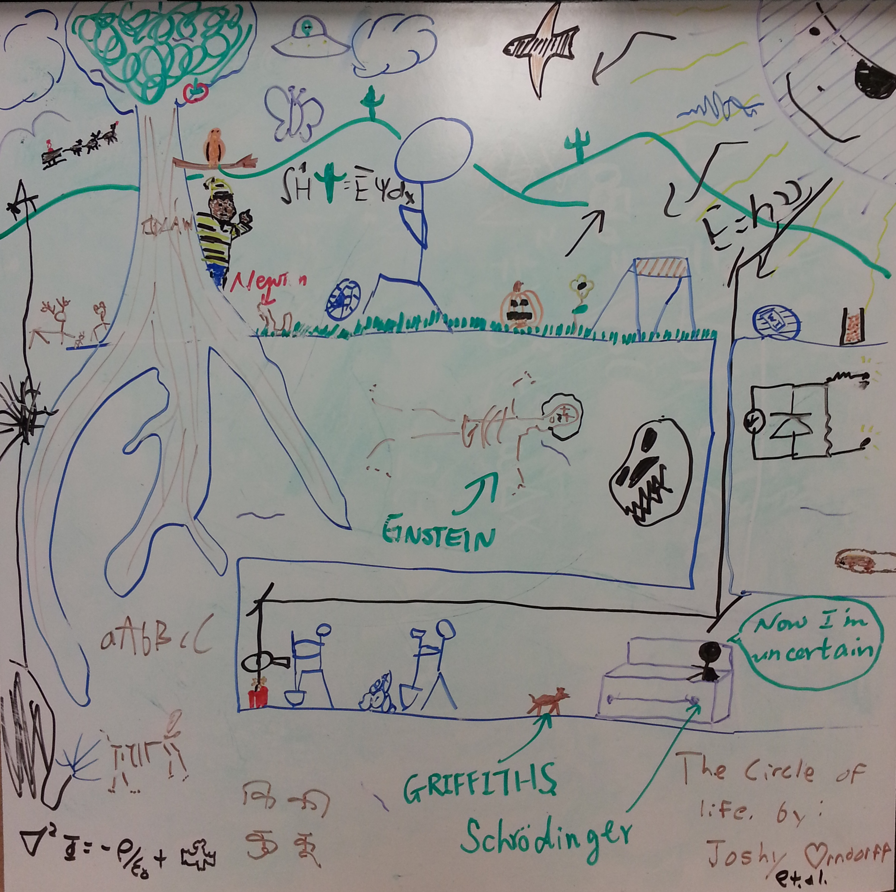
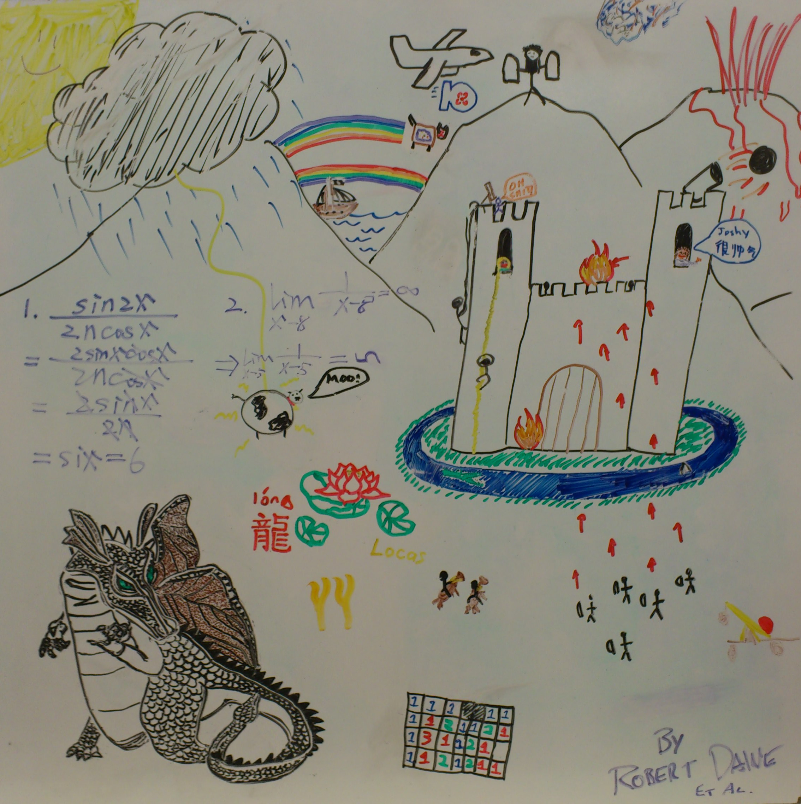
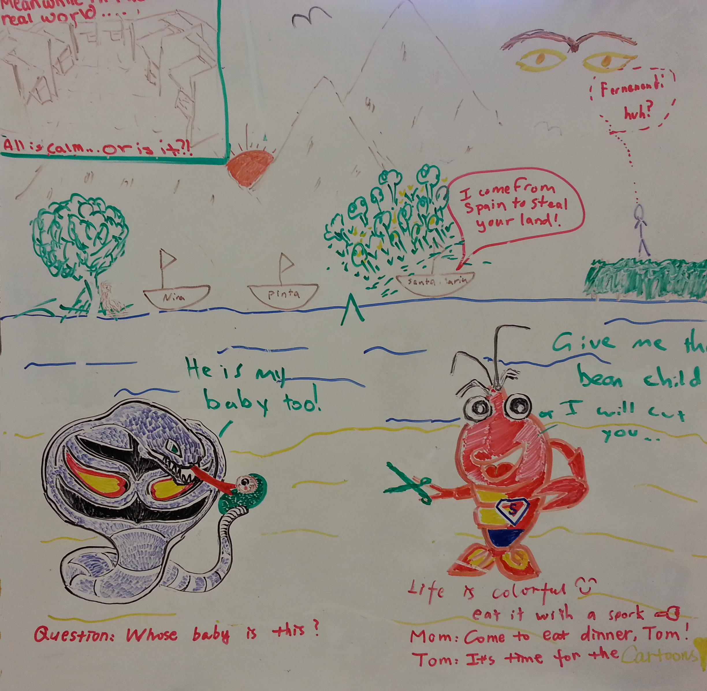
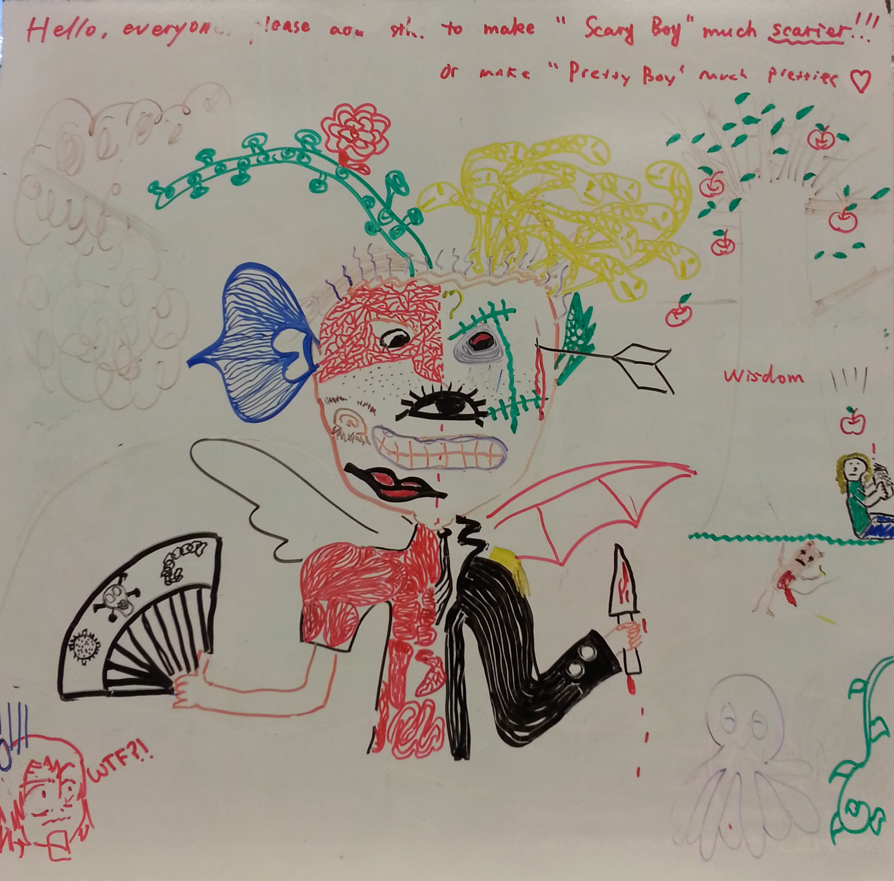
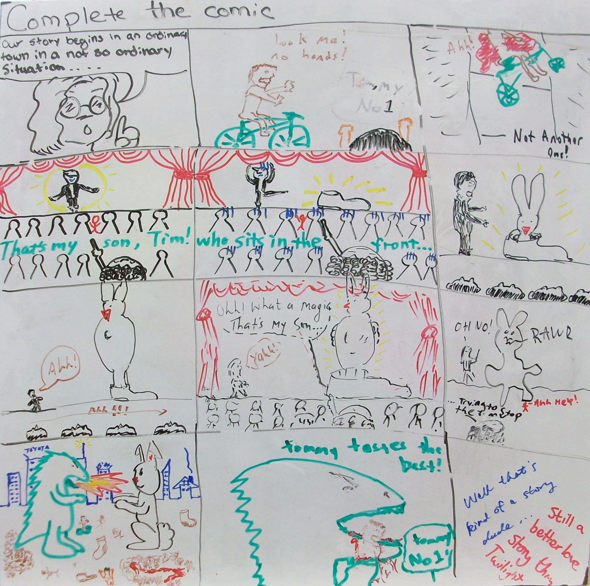
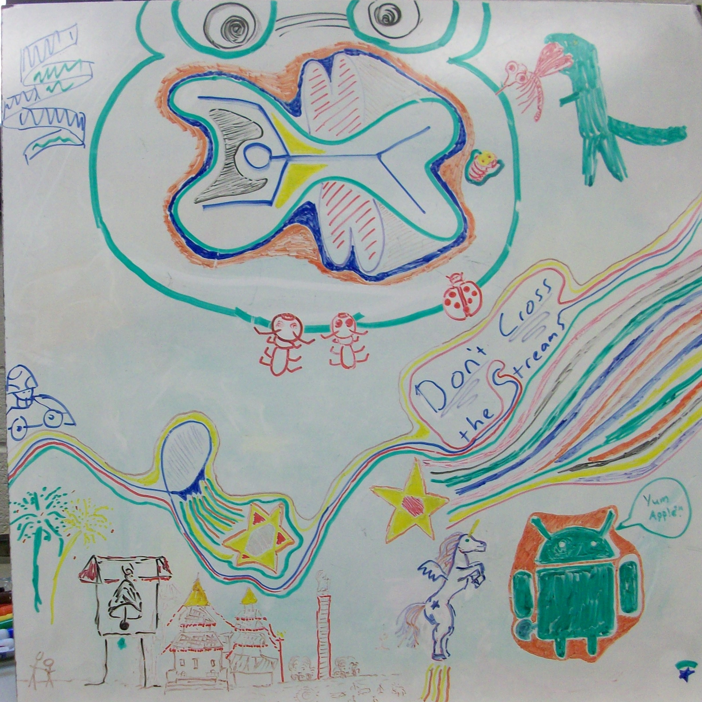
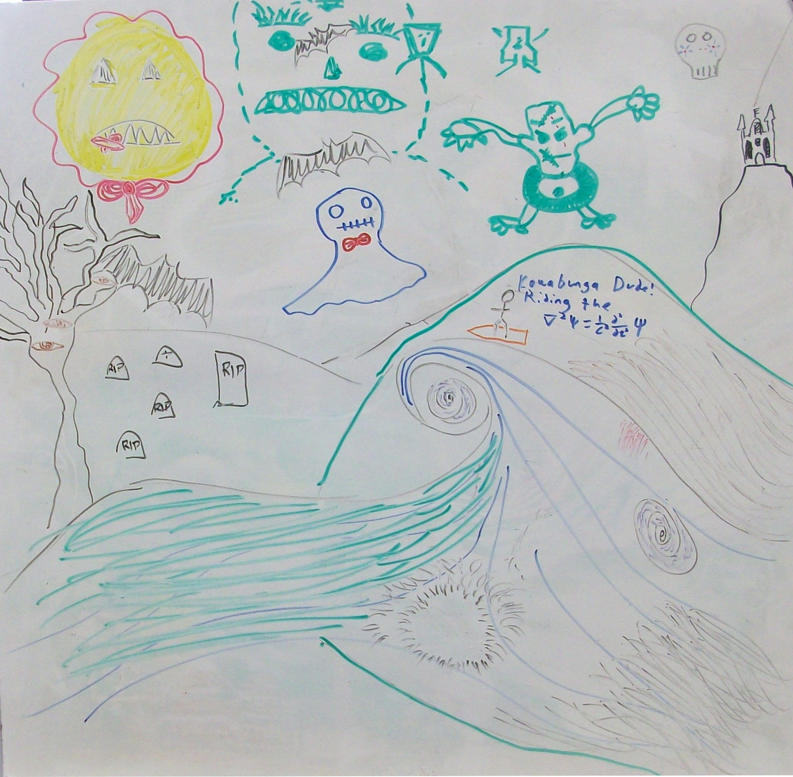
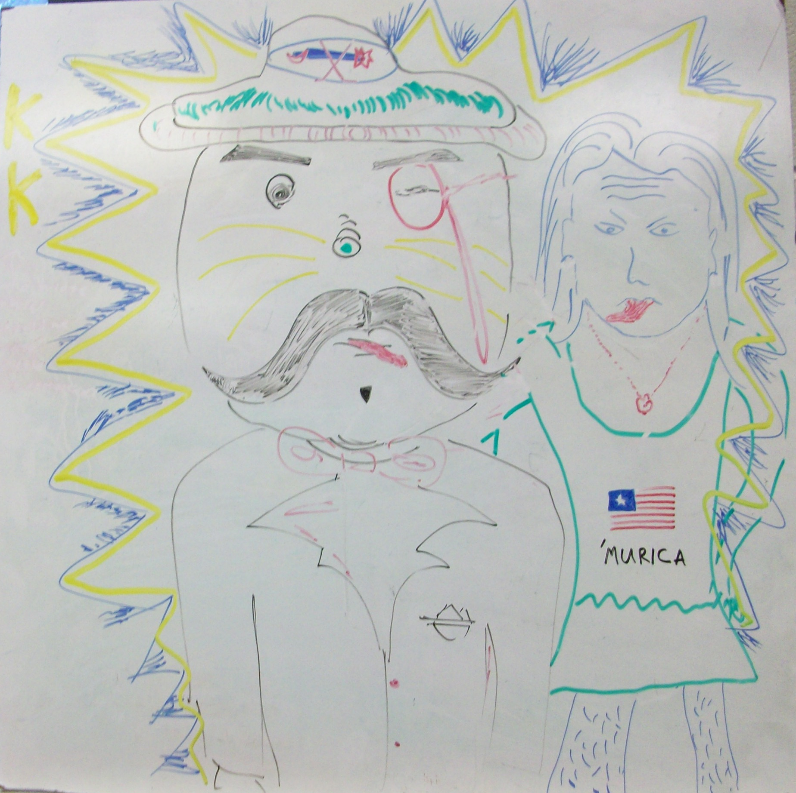
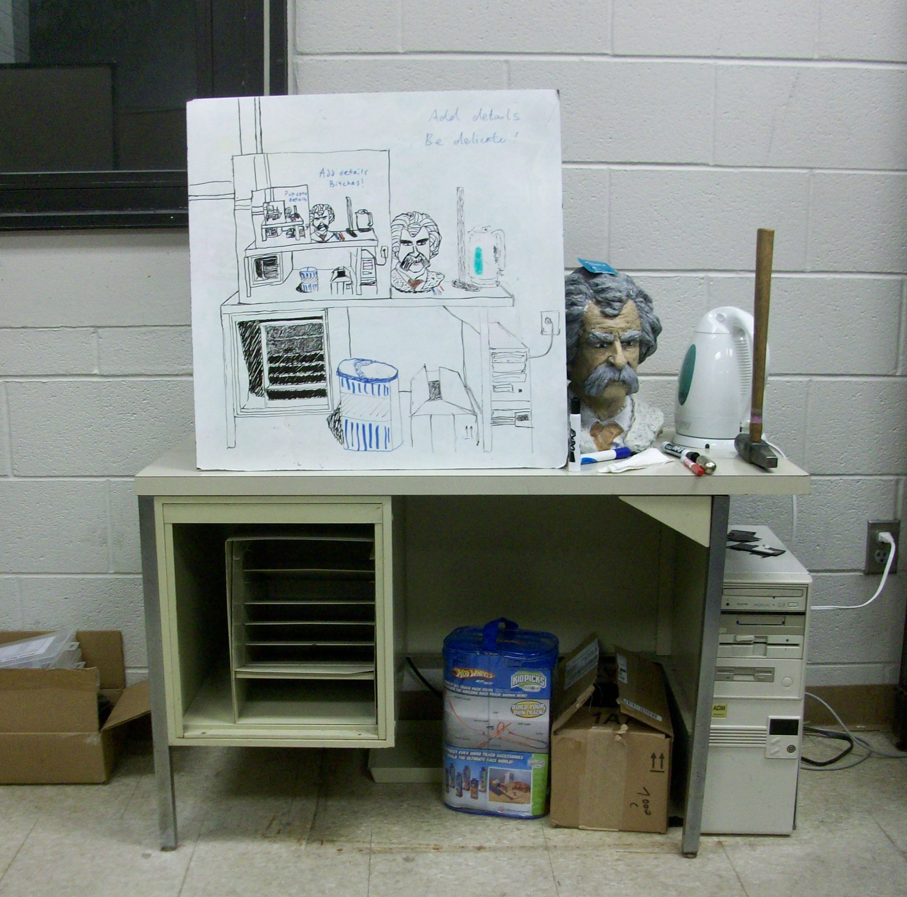
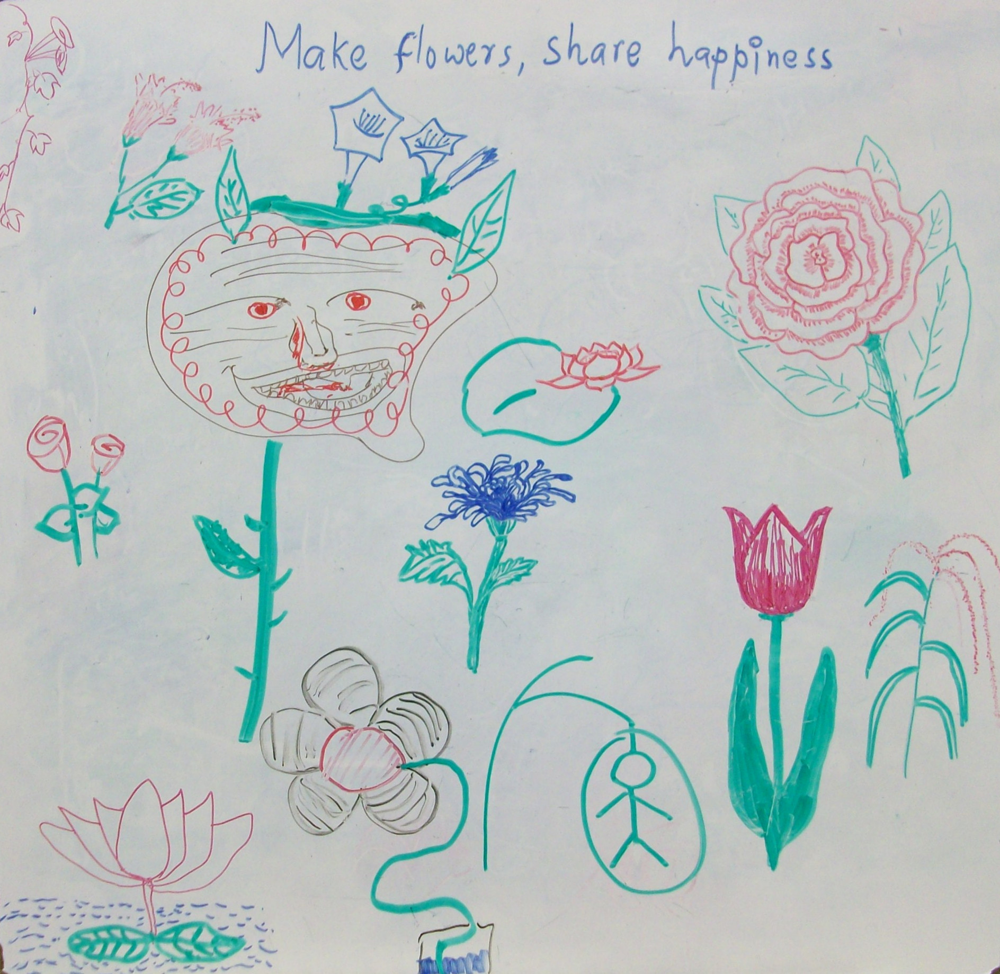

+++
title = "White Board Drawings"
date = "2012-12-21T02:43:51+00:00"
tags = []
categories = []
image = "Picture2-CantWaitToBeKing.jpg"
+++

During the past semester, my office has created a series of community art drawings. The process is as follows:
<ol>
<li>Someone draws something on the white board</li>
<li>Other people add to it whenever and however they like</li>
<li>When the board is full, or additions have stopped, I take a picture</li>
<li>I erase the board</li>
<li>Return to step one</li>
</ol>

Some of them are weird some of them are cool. I think it was a fun and interesting project.

Photos:

