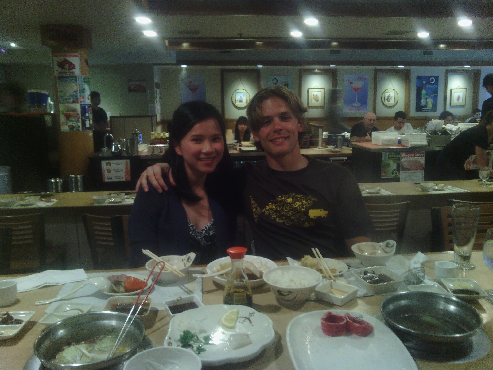
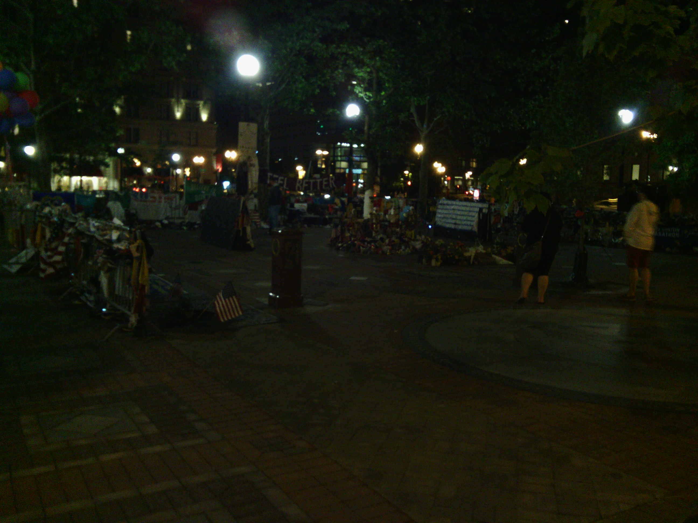

+++
title = "Wrapping up and thanks"
date = "2013-06-18T00:38:27+00:00"
tags = ["Bicycle Trip"]
categories = []
image = "IMG_20130614_191842.jpg"
+++

After savoring the feeling of standing in the Atlantic. Maggie and I picked up a bike box from a local shop and checked into our hotel in downtown Boston. We spent the evening packing up my bike for the train ride back to Ohio, and generally enjoying the feeling of completion.  She treated me to a celebration dinner at a Japanese hot pot restaurant and after hanging around for a while got dessert and calculated some data about the trip (shared in the next post).

The next morning we got breakfast and carried my bike to the train station. It was the end of an amazing experience.

I want to thank everyone who helped out along the way on this trip in ways large or small including all the people on this list and anyone else who I may have forgotten to mention.

* My parents
* Maggie Nguyen
* Amanda Mitchell and her parents
* Anna Wu
* Charlotte Sandy
* Linda and Kevin Nitschke
* Bonita Chavez
* Kevin Hardegree-Ullman
* The entire Mogk family
* Paige and Steve Hannah
* Phil and Jessi Mickelson
* The worker at Stuckey's who suggested a campground
* Kay and everyone else I chatted with in Higgins
* The owners and mechanic at District Bicycles
* Jean and Tom Thornbrough
* The owners and campers at Gasconade hills resort
* The owners at Ladybug RV park
* The camp hosts at Robertsville state park
* Sarah Dugan
* Lynn Marsh
* Chad Jaggard
* Roger Bear
* Wes Robinson, and everyone I met in Indianapolis
* Jason Roland and Emily
* David Dornbos and Jesi Hale
* Aaron Goodman
* Michelle Tomczyk
* Pilang Thach and her roommates
* Reuben Bushnell and his friends and roommates
* The guy who offered to drive me to a bike shop in the next town
* The owner of Paradise campground resort
* Ray, the owner of Wildnerness lake Campground
* Annika and Mike Bangma
* And everyone who encouraged me and commented on this journal, and sent me supportive messages along the way.

Photos:

